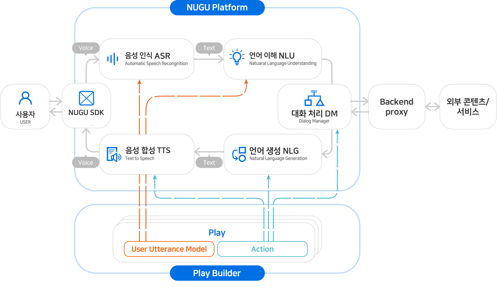

# NUGU developers 소개

NUGU developers에 오신 것을 환영합니다.

NUGU는 SK 텔레콤의 인공지능 기술로서, 사용자의 자연어\(음성 언어 또는 문자 언어\) 요청을 이해하여 의도를 파악한 후 특정 명령을 수행하거나 자연어로 응답하는 대화 기반 인공지능 플랫폼입니다.

NUGU 플랫폼은 NUGU 스피커, T map, B tv, 키즈폰 등 다양한 PoC\(Point of Contact\)에 적용돼 있으며 월간 실 사용자 600만 명을 넘어서고 있습니다.

NUGU developers는 대화 기반 인공지능 서비스를 개발할 수 있는 통합 개발 환경을 GUI 기반으로 제공함으로써, 사용자들은 NUGU developers를 통해 좀더 쉽게 자신들의 서비스를 개발할 수 있습니다.

NUGU developers를 사용하면 SK 텔레콤이 보유한 최고 수준의 음성 인식, 음성 합성, 자연어 이해 분야의 기술력을 경험할 수 있습니다.

다음은 사용자 발화를 처리하는 과정입니다.

* 사용자 발화는 '음성 인식, 자연어 이해'를 통해 그 의도가 파악되고
* 대화 관리자는 파악된 의도에 맞는 액션을 수행하여 사용자에게 전달할 응답을 생성하며
* 생성된 응답은 음성 합성 모듈을 거쳐서 사용자에 합성음으로 전달합니다.

NUGU developers는 사용자 발화가 처리되는 과정에 반드시 필요한 요소 기술들을 제공하고, 서비스를 개발할 수 있는 통합 개발 환경인 **Play Builder**를 제공합니다. 개발한 서비스는 '심사와 배포' 과정을 거친 후 NUGU 사용자들에게 공개됩니다.

특히 **NUGU biz**를 통해 특정 사용자 그룹 또는 전용 디바이스에만 해당 서비스가 제공될 수 있도록 설정할 수 있습니다.

NUGU developers는 개발자가 아니어도 대화 기반 인공 지능 서비스를 개발할 수 있는 플랫폼입니다. NUGU developers는 좋은 콘텐츠를 보유하였으나 개발 인력이 없는 업체가 자신들의 서비스를 개발할 수 있습니다. 1600만 NUGU 사용자에게 좋은 서비스를 제공하길 희망하는 모든 분들은 NUGU developers를 통해 그 희망을 실현할 수 있을 것입니다.

