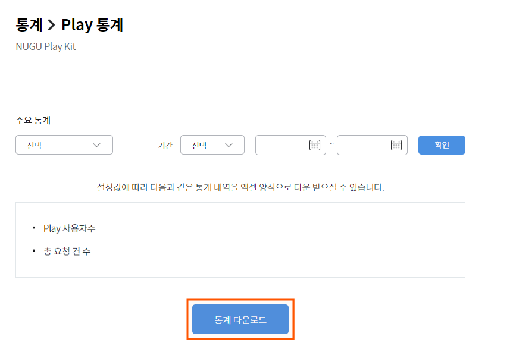

Play 이용 통계 확인 {#monitor-play-stats}
====================

서비스 중인 Play의 이용 통계를 확인할 수 있습니다. `NUGU developers` > `NUGU play kit` > `통계` 메뉴에서 확인할 수 있으며, 통계 항목은 다음과 같습니다.

**Play 사용자 수** 
Play를 사용한 순 이용자 수(Unique User)

**총 요청 건 수** 
해당 Play로 분석된 사용자의 발화 건 수

**주요 발화 Top 20** 
Play 사용을 위해 사용자가 발화한 음성명령 Top 20

## 주요 통계 {#main-stats}
주요 통계 메뉴를 통해 Play 전체 또는 Play별 사용자 요청 건 수, 총 요청 건 수를 확인할 수 있으며, 조회 결과를 통계 데이터로 다운로드할 수도 있습니다.

1. `NUGU developers` > `NUGU play kit` > `통계` 페이지의 주요 통계 항목에서 Play 전체 또는 개별 Play를 선택하고, 조회 기간을 설정한 후 `확인` 버튼을 클릭합니다.
조회할 Play를 `전체`로 선택하면 서비스 제공자가 상용 배포한 모든 Play의 통계가 합산되어 제공됩니다.

2. Play 통계 조회가 완료되면 `통계 다운로드` 버튼을 클릭하여 조회 결과를 다운로드합니다. 데이터는 엑셀 파일로 저장됩니다.

## 주요 발화 통계 {#utterance-stats}
`NUGU developers` > `NUGU play kit` > `통계` 페이지의 주요 발화 통계 항목에서 조회할 Play를 선택하고, 조회 기간을 설정한 후 `확인` 버튼을 클릭합니다.

조회가 완료되면 주요 발화 Top 20 리스트에서 발화 내용을 확인할 수 있습니다.

