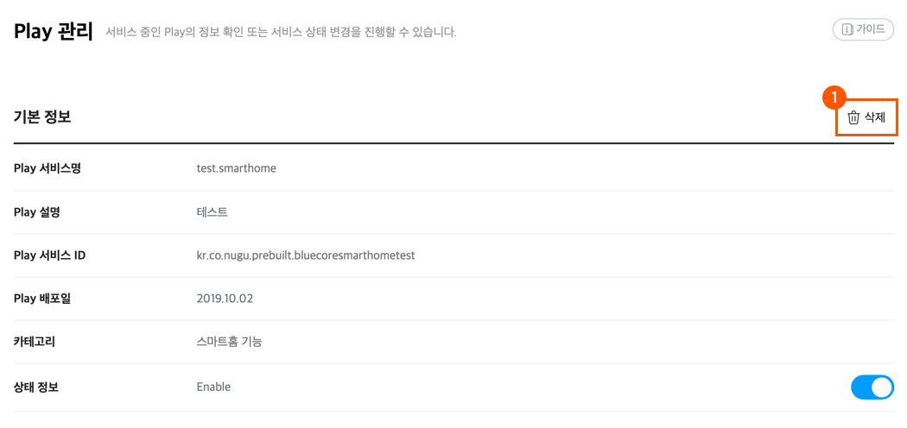

# Play 관리

배포된 Play의 정보 확인 및 서비스 중지, 재개, 삭제, 이용 통계 등의 상태 관리는 `NUGU developers` &gt; `NUGU play kit` &gt; `관리` &gt; `Play 관리` 메뉴 기능을 통해 확인하거나 설정할 수 있습니다.

## Play 정보 확인 

배포가 완료된 Play는 `NUGU developers` &gt; `NUGU play kit` &gt; `관리` &gt; `Play 관리` 메뉴에서 상세 정보를 확인하고 상태를 변경할 수 있습니다.

이 페이지에서 확인할 수 있는 Play의 정보는 다음과 같습니다.

* Play 서비스명
* Play 서비스 ID 
* Play 설명
* Play 배포일
* Play 타입
* Play 카테고리
* 계정 연동 기능 사용 여부
* Play 상태 정보\(Enable or Disable\)
* 주요 기능 및 대표 발화
* 업데이트 히스토리
* Play가 제공 중인 전용 디바이스\(Private Play에 한함\)
* Play를 사용중인 사용자\(Private Play에 한함\)

## Play 상태 변경\(중지 및 서비스 재개\) 

`NUGU developers` &gt; `NUGU play kit` &gt; `관리` &gt; `Play 관리`메뉴에서 현재 서비스 중인 Play에 대해 중지\(Disable\)하거나 중지\(Disable\) 상태의 Play를 재개\(Enable\)할 수 있습니다.

1️⃣ 관리 현황 리스트에서 상태를 변경할 Play를 클릭하여 선택합니다.

2️⃣상태 정보 항목의 `Enable` 또는 `Disable` 버튼을 클릭한 후, 상태 변경 확인창에서 \[확인\] 버튼을 클릭하여 상태를 변경합니다.

상태를 변경하면 해당 Play의 상태가 Enable 또는 Disable 상태로 바뀌며 서비스가 중지되거나 재개됩니다.

\(Play 사용 여부 현황은 `NUGU developers` &gt; `NUGU play kit` &gt; `관리` &gt; `Play 관리` 페이지의 `관리 현황`에서 확인할 수 있습니다.\)


Play의 상태 변경\(Enable → Disable, Disable → Enable\)은 자유롭게 설정할 수 있으나 NUGU developers의 관리자가 직권 중지한 Play는 개발자가 직접 재개할 수 없습니다.

이 경우 NUGU developers 운영자\([dev.help\_nugu@sk.com](mailto:dev.help_nugu@sk.com)\)에게 연락하여 Play 직권 중지 사유에 대해 확인을 해야 합니다. 이후 중지 사유가 해결됐을 경우에만 Play 서비스를 재개할 수 있습니다.


## Play 삭제 

`NUGU developers` &gt; `NUGU play kit` &gt; `관리` &gt; `Play 관리` 메뉴에서 현재 서비스 중인 Play를 삭제할 수 있습니다.

1️⃣ 관리 현황 리스트에서 삭제할 Play를 클릭하여 선택합니다.

2️⃣ 화면 상단의 `삭제` 버튼을 클릭합니다.


* 서비스 중인 Play는 고객 VoC 발생 시 해결하기 위해 「NUGU developers」 이용약관 제15조 제7항을 근거로 60일 동안 중단 처리 기간을 진행합니다.
* 중단 처리 기간이 완료된 후에는 전자상거래법상 표시 광고에 관한 기록 보관기간인 6개월간 Play의 정보가 보관됨을 안내해 드리며, 6개월 이후 Play의 정보는 삭제 됩니다.
* Play가 삭제되면 NUGU play kit에 등록한 해당 Play 관련 정보를 모두 삭제하고, 서비스를 중지합니다.


