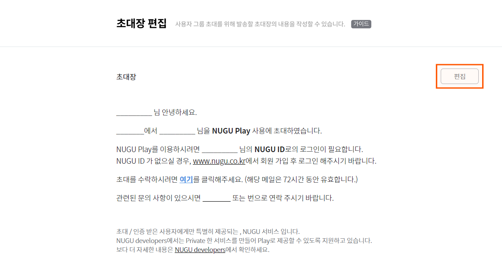
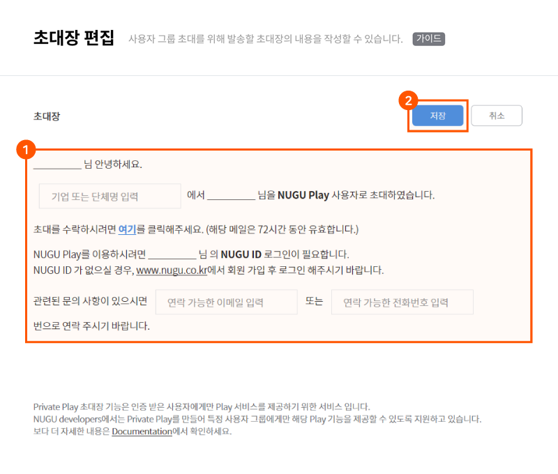
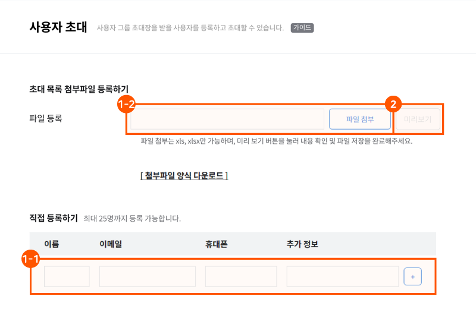
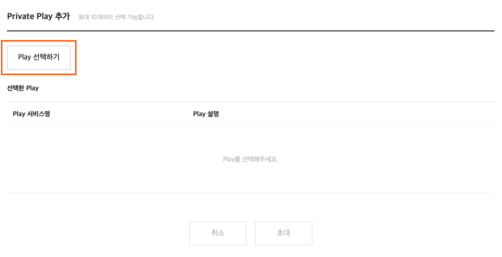

# 사용자 그룹 관리

특정 사용자 그룹을 초대하여, Private Play를 사용할 수 있도록 권한을 부여하고 관리하는 기능입니다. 자사 임직원 또는 단체에 소속된 회원만 초대하여 회원들의 NUGU 디바이스에서 Private Play를 사용하게 할 수 있습니다. 초대된 사용자가 초대 승인 및 인증 절차를 완료하면, Private Play 이용이 가능합니다.


초대 받은 사용자는 초대장을 확인하고, Private Play 사용에 동의해야 해당 서비스를 이용할 수 있습니다.  
초대장 인증\(사용자 인증\)에 대한 자세한 내용은 [초대장 인증\(사용자 인증\)](manage-enrolled-user.md#user-verification)을 참고하세요.


## 초대장 작성 

사용자 초대를 위해 먼저, 사용자에게 전송할 초대장을 작성해야 합니다.

1. `NUGU developers` &gt; `NUGU biz` &gt; `사용자 그룹 관리` &gt; `초대장 편집` 메뉴에서 기본 제공되는 템플릿의 `편집` 버튼을 클릭하여 편집 모드로 전환합니다.

   

2. 초대 주체명\(개인, 기업, 단체명\), 사용자의 문의 사항에 대해 응대할 수 있는 연락처 정보\(이메일, 전화번호\)들을 입력하고 `저장` 버튼을 클릭하면 초대장 작성이 완성됩니다.
   * 입력 필드는 최소 1자 이상 최대 60자까지 입력할 수 있습니다.
   * 초대 주체명, 연락처 정보\(이메일, 전화번호\)는 필수 입력 정보입니다.

     

## 사용자 등록 및 초대 

초대장 작성이 끝나면 초대장을 받을 사용자를 등록하고 초대합니다.

1. `NUGU developers` &gt; `NUGU biz` &gt; `사용자 그룹 관리` &gt; `사용자 초대` 메뉴에서 사용자를 등록합니다.
   * 사용자 등록은 첨부파일을 이용하여 일괄 등록하거나 직접 입력할 수 있습니다.
   * 직접 입력 시 이름, 이메일, 휴대폰 정보는 필수 입력 정보입니다.

     
2. Play 선택 항목에서 `+Private Play` 버튼을 클릭하여 사용자에게 제공할 Private Play를 선택합니다.\(최대 3개까지 선택할 수 있습니다.\)

   

3. 사용자 등록 및 Private Play 선택을 완료한 후 `초대` 버튼을 클릭하면 등록한 사용자에게 이메일로 초대장이 발송됩니다.

   


이메일로 발송된 초대장의 유효 기간은 72시간입니다. 유효 기간이 경과한 후에는 초대장을 다시 발송해야 합니다.


## 초대장 인증\(사용자 인증\) 

초대장을 받은 사용자가 Private Play를 사용하려면 NUGU 회원 ID로 로그인 인증이 필요합니다.\(NUGU 회원 가입은 [www.nugu.co.kr](http://www.nugu.co.kr) 또는 NUGU App에서 할 수 있습니다.\)

사용자는 이메일로 수신된 초대장을 통해 NUGU ID 인증 페이지로 이동할 수 있으며, 로그인 인증 시점부터 Private Play 이용이 가능합니다.

제공 받은 Private Play의 상세 정보는 NUGU App에서 확인할 수 있습니다.


Private Play 사용자는 언제든지 NUGU App에서 Private Play 이용 권한을 해제할 수 있습니다. 해제 시 Private Play 이용 권한이 삭제되며, 삭제된 이후에는 Private Play를 이용할 수 없습니다.

만약, 권한 재부여를 원할 경우에는 서비스 관리자가 NUGU developers를 통해 다시 초대장을 발송해야 합니다.


## 초대 히스토리 관리 

`NUGU developers` &gt; `NUGU biz` &gt; `사용자 그룹 관리` &gt; `초대 히스토리`에서 초대장을 발송한 사용자 리스트, 이메일 정보, 초대장 발송 날짜, 인증 상태\(초대장 인증/미인증\)를 확인할 수 있습니다. 또한 `초대장 재발송` 및 `초대 취소` 기능을 이용하여 초대장을 관리할 수 있습니다.


`초대장 재발송` 및 `초대 취소`는 사용자\(User\)가 초대장을 인증하기 전일 경우에만 가능합니다.


## 사용자 정보 

`NUGU developers` &gt; `NUGU biz` &gt; `사용자 그룹 관리` &gt; `사용자 정보`에서 초대를 승인한 사용자의 현황을 확인할 수 있습니다.

사용자의 기본 정보\(이름, 이메일, 초대날짜\) 외에도 초대 승인 날짜, 제공된 Private Play 등의 정보를 확인할 수 있습니다.

또한 Private Play 사용이 승인된 사용자를 삭제할 수 있으며, 사용자 삭제 시에는 사용자\(user\)에게 제공된 Private Play 사용 권한이 해제됩니다.


Private Play 사용 권한이 삭제된 사용자에게 권한을 재부여하고자 할 경우에는 신규 초대장을 발송해야 합니다.


