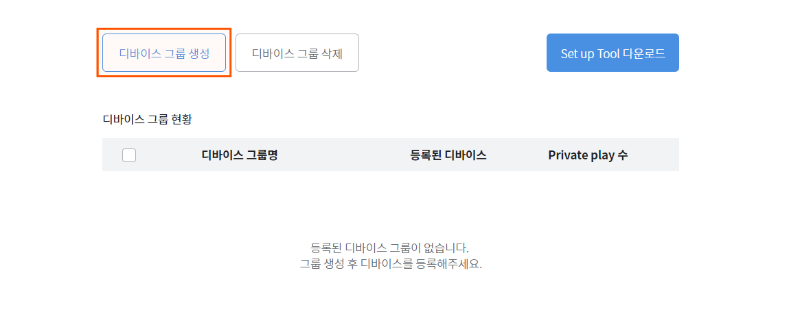
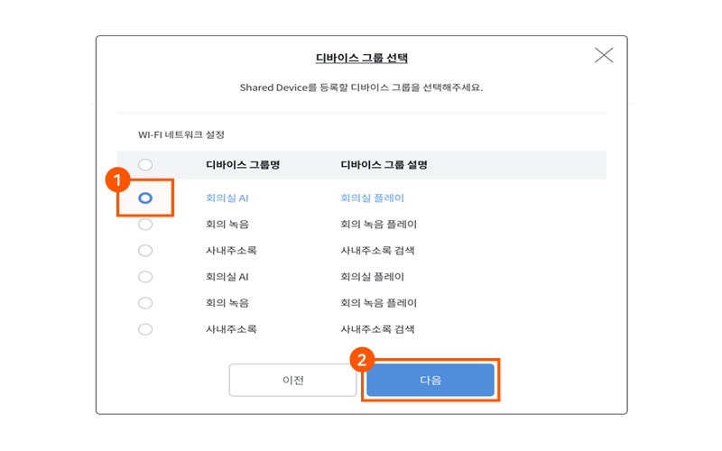
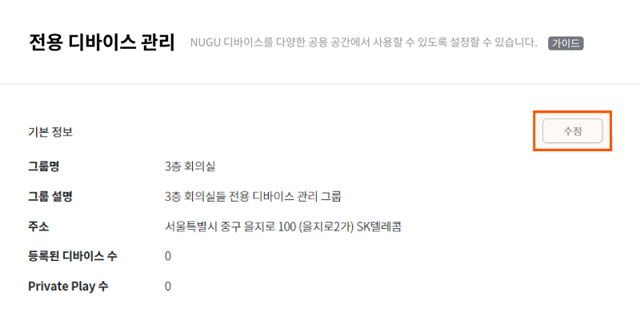
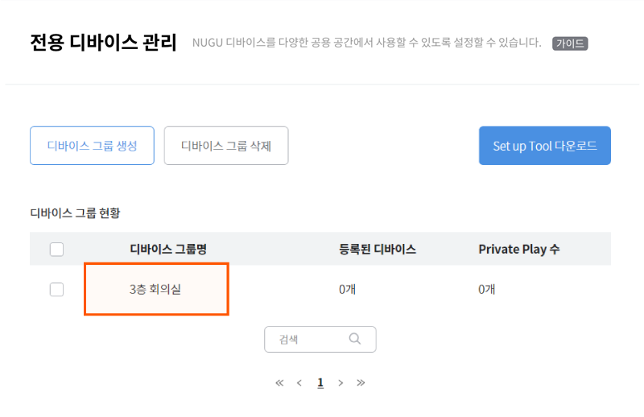

# 전용 디바이스 관리

NUGU 디바이스를 사업장/영업장 등과 같은 공용 공간에서 누구나 사용할 수 있도록 설정하는 기능입니다. NUGU developers 계정에 NUGU 디바이스를 등록하면 디바이스 상태가 변경\(개인 디바이스 → 전용 디바이스\)되며, 공용 공간에 설치하여 이용할 수 있습니다. 전용 디바이스로 설정되면 NUGU 개인 계정과 연결 없이, 해당 공간을 이용하는 사람은 누구나 사용할 수 있습니다. 사무공간, 호텔, 병원 등 다양한 공용 공간에서 전용 디바이스를 이용할 수 있습니다.

## 등록 프로세스 

전용 디바이스 기능 사용을 하려면, 먼저 디바이스를 등록해야 합니다.

디바이스 등록은 사전 준비 → 디바이스 그룹 생성 → 디바이스 Setup Tool 설치 → Setup Tool을 통한 디바이스 등록 및 설정 프로세스로 진행합니다.

## 사전 준비 

전용 디바이스의 등록 설정을 위해선, 아래와 같은 사전 준비와 확인이 필요합니다.

**디바이스 전원 켜짐 확인**  
디바이스의 전원이 켜져 있어야 합니다.

**디바이스 설정 모드\(Setup 모드\)**  
처음 개봉한 디바이스는 전원을 켜면 자동으로 설정 모드로 진입하기 때문에 별도의 설정 작업을 진행하지 않아도 됩니다. 단, 이미 사용하고 중인 디바이스의 경우 스피커의 상태등이 초록색으로 변할 때 스피커 상단의 음소거 버튼을 길게\(7-8초\) 눌러 설정 모드로 변경해야 합니다.

**Wi-Fi 연결 환경 확인**

디바이스 등록 작업을 진행할 PC 또는 노트북에서 Wi-Fi 연결이 가능해야 합니다.

## 디바이스 그룹 생성 

사전 준비가 끝나면 다음으로 디바이스 그룹을 생성합니다.

1. `NUGU developers` &gt; `NUGU biz` &gt; `전용 디바이스 관리` 메뉴에서 `디바이스 그룹 생성` 버튼을 클릭합니다.

   

2. 디바이스 그룹 생성 팝업에서 생성할 디바이스 그룹의 기본 정보\(디바이스 그룹명, 디바이스 그룹 설명, 주소\)를 입력하고 `생성` 버튼을 클릭하면 그룹이 생성됩니다.
   * 특정 주소 정보가 필요한 서비스\(예: 날씨\)의 경우, 주소를 등록하면 등록한 주소지를 기준으로 서비스가 제공됩니다.

     

   * 디바이스 그룹 현황 리스트에 생성한 디바이스 그룹이 표시됩니다.

     

## Setup Tool 설치 및 디바이스 등록 

디바이스 그룹을 생성한 후에는 \[Setup Tool\]을 설치하고 사용할 디바이스를 등록합니다.

1. `NUGU developers` &gt; `NUGU biz` &gt; `전용 디바이스 관리` 메뉴에서 `Setup Tool 다운로드` 버튼을 클릭하여 설치 파일을 내려받아 프로그램을 설치합니다.

   


디바이스 Setup Tool은 Window 7 이상에서만 사용할 수 있습니다. Mac에서는 이용할 수 없습니다.


1. Setup Tool 프로그램을 실행하고, 전용 디바이스를 등록할 디바이스 그룹명을 선택하고 `다음` 버튼을 클릭합니다.

   

2. `디바이스 검색` 버튼을 클릭하여 전용 디바이스로 등록할 디바이스를 검색 및 선택한 후 `다음` 버튼을 클릭합니다.

   


* 디바이스 검색 시 디바이스 등록 번호로 노출이 됩니다. 등록 번호는 스피커 제품 하단에 명시되어 있습니다. 단, NUGU mini\(NU200\) 디바이스는 “NU-110XXXX”형태의 번호가 등록번호입니다.
* 디바이스가 검색되지 않으면 NUGU 디바이스가 설정 모드로 설정되어 있는지 다시 한번 확인하세요.


1. `Wi-Fi 검색` 버튼을 클릭하여 전용 디바이스에 등록하려는 Wi-Fi 네트워크를 선택한 후 `다음` 버튼을 클릭하여 네트워크를 설정합니다.

   

2. 네트워크 설정을 완료한 후 `다음` 버튼을 클릭하여 NUGU developers에 전용 디바이스로 등록을 요청합니다.

   


보안 네트워크는 암호를 입력해야 합니다.


1. 디바이스 상태가 디바이스 등록 완료로 모두 변경되면 `다음` 버튼을 클릭합니다.

   

2. 디바이스 최종 등록 완료 메시지가 표시되면 `확인` 버튼을 클릭하여 작업을 종료합니다.

   


디바이스는 한 번에 최대 25대씩 등록할 수 있습니다.


## 디바이스 그룹 관리 

이 메뉴에서는 디바이스 그룹 정보를 수정 또는 삭제, 서비스 계정\(Master Account\) 연동, 등록된 전용 디바이스 삭제, Private Play 추가 등의 작업을 할 수 있습니다.

### 디바이스 그룹 정보 수정/삭제

디바이스 그룹 생성 시 등록한 정보\(그룹명, 그룹 설명, 주소\)를 수정하거나 디바이스 그룹을 삭제할 수 있습니다.

1. `NUGU developers**)] >`NUGU biz`>`전용 디바이스 관리\` 페이지의 디바이스 그룹 현황 리스트에서 정보를 수정할 디바이스 그룹명을 클릭하여 선택합니다.

   

2. 상세 보기 페이지의 기본 정보 항목에 있는 `수정` 버튼을 클릭한 후 그룹명, 그룹설명, 주소 등의 기본 정보를 변경합니다.

   

디바이스 그룹을 삭제하려면, 디바이스 그룹 현황 리스트에서 삭제할 디바이스 그룹 선택 후 `디바이스 그룹 삭제` 버튼을 클릭합니다.


디바이스 그룹을 삭제하면 그룹에 등록된 디바이스의 전용 디바이스 등록이 해제되며, 전용 디바이스 이용이 중지됩니다.


### 서비스 계정 연동/해제

디바이스 그룹에 등록된 전용 디바이스에 동일하게 적용하여 사용할 서비스 계정을 연동할 수 있습니다. 상용 서비스인 멜론, 뮤직메이트, 구글 캘린더 서비스 이용을 위해서는 서비스 계정\(Master account\) 연결이 필요합니다.

1. `NUGU developers` &gt; `NUGU biz` &gt; `전용 디바이스 관리` 페이지의 디바이스 그룹 현황 리스트에서 서비스 계정을 연동할 디바이스 그룹명을 클릭하여 선택합니다.

   

2. 디바이스 그룹 상세 페이지의 서비스 계정 연동 항목에서, 계정을 연결할 서비스의 `로그인` 버튼을 클릭합니다.

   

3. 계정 연결 로그인 설정 팝업창에서 해당 서비스에 연결할 아이디와 비밀번호를 입력한 후 `연결하기` 버튼을 클릭하여 계정을 연결합니다.

   계정 연결이 완료되면 서비스 계정 연동 항목에서 연결 상태와 계정 정보를 확인할 수 있습니다.

   * 연동 중인 서비스 계정을 해제하려면, 해제할 서비스의 `연결해제` 버튼을 클릭합니다.

     

### 등록된 디바이스 삭제

Setup Tool을 통해 디바이스 그룹에 등록한 전용 디바이스를 삭제할 수 있습니다.

1. `NUGU developers` &gt; `NUGU biz` &gt; `전용 디바이스 관리` 페이지의 디바이스 그룹 현황 리스트에서 등록된 디바이스를 삭제할 디바이스 그룹명을 클릭하여 선택합니다.

   

2. 상세 페이지의 등록된 디바이스 항목에서 삭제할 디바이스를 선택한 후 \[- \*\*디바이스 삭제\` 버튼을 클릭합니다.

   


디바이스를 삭제하면 전용 디바이스 등록이 해제됩니다.

해제된 디바이스는 Setup Tool을 통해 전용 디바이스로 재등록할 수 있습니다.


### Private Play 추가/삭제

해당 디바이스 그룹에 등록된 전용 디바이스에 제공할 Private Play를 추가/삭제할 수 있습니다.

1. `NUGU developers` &gt; `NUGU biz` &gt; `전용 디바이스 관리` 페이지의 디바이스 그룹 현황 리스트에서 Private Play 추가 또는 삭제할 디바이스 그룹명을 클릭하여 선택합니다.

   

2. 상세 페이지의 Private Play 항목에서 `+ Play 추가` 버튼을 클릭하여 Private Play 추가할 수 있습니다.

   

3. 등록한 Private Play를 삭제하려면, 삭제할 Private Play를 선택하고 `- Play 삭제` 버튼을 클릭합니다.

   

## 전용 디바이스의 서비스 이용 제한 

NUGU 디바이스를 전용 디바이스로 등록하면 NUGU에서 제공되는 일부 서비스의 이용이 제한됩니다.

제한되는 서비스 항목은 다음과 같습니다.

* 폰찾기
* MY Q&A
* 긴급 SOS
* 도미노 피자
* BBQ 치킨
* 홈픽 택배
* 길찾기
* 오디오 북
* 스마트 홈
* 11번가 쇼핑
* B tv 연동

