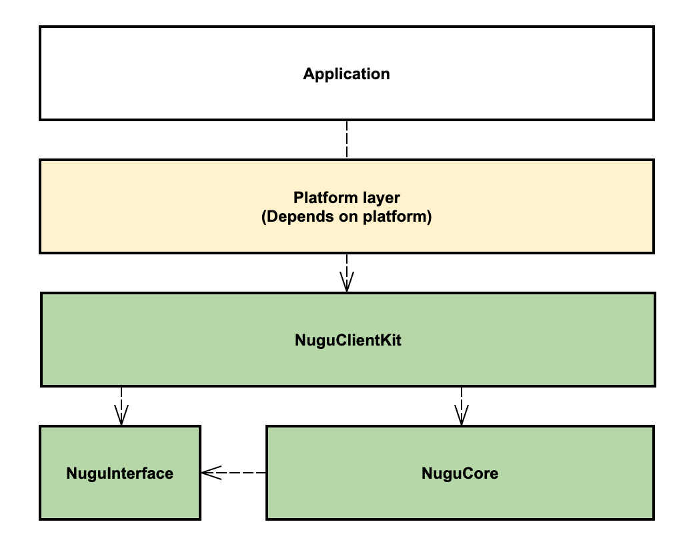

# Platform

### NUGU SDK

NUGU SDK는 iOS, Android, Linux 플랫폼을 지원합니다. 각각의 플랫폼에 맞는 언어와 특성을 따르고 있으며, 동일한 구조를 가지고 있는 영역\(Common\)과 플랫폼 별로 다른 구조를 가진 영역\(Depends on platform\)이 구분되어 있습니다. 

### Architecture

