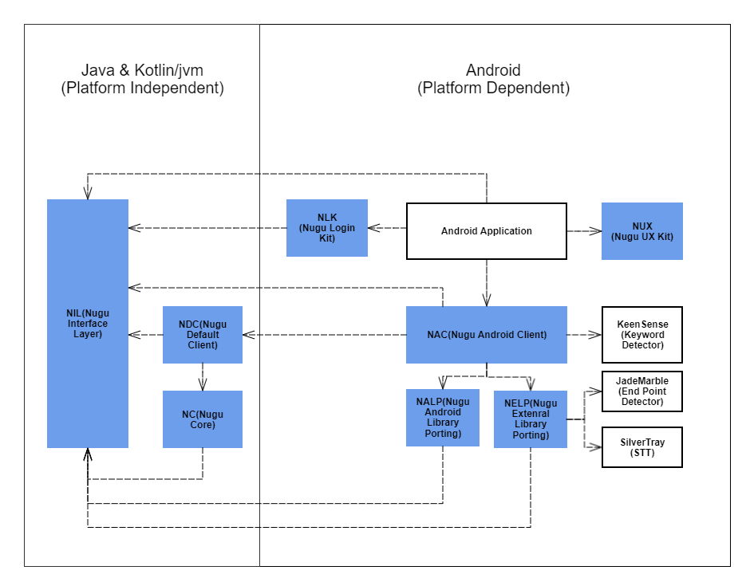

# 구성요소 소개

## Overview

The SDK consist of following components. Look at diagram.

1. NIL\(Nugu Interface Layer\) : Provide interfaces to communicate with NUGU SDK.
2. NC\(Nugu Core\) : This component implements core logic for NUGU service.
3. NDC\(Nugu Default Client\) : Provide a platform independent client to help you integrate into the application.
4. NAC\(Nugu Android Client\) : Provide a default android client to help you integrate into the application simply.
5. NALP\(Nugu Android Library Porting\) : This ports the android framework's components such as MediaPlayer for use in the NC.
6. NELP\(Nugu External Library Porting\) : This ports the external library such as [JadeMarble](https://tde.sktelecom.com/stash/projects/ROMAINE/repos/jademarble-android/browse), SilverTray for use in the NC
7. NUX\(Nugu UX kit\) : Provide an UX components that follow NUGU's design guide.
8. NLK\(Nugu Login Kit\) : Provide a utility class to login Nugu briefly.

## Components

#### NIL\(Nugu Interface Layer\)

#### NC

#### NDC

#### NAC

#### NALP

#### NELP

#### NUX

