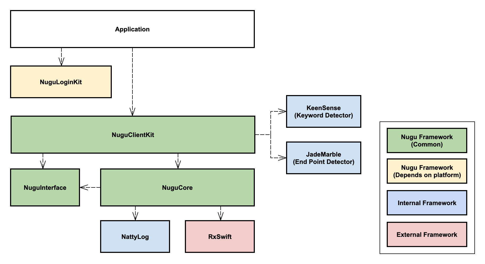

# 구성요소



## 구성요소 목록


NUGU SDK for iOS 를 통한 개발을 위해서는 `NuguCore`, `NuguInterface` Framework를 필수로 포함해야 합니다.


* NUGU Component \(Common\)
  * **`NuguCore`**: NUGU 서비스 이용에 필요한 구성요소들의 기본 구현을 제공합니다.
  * **`NuguInterface`**: NUGU SDK를 구성할 때 필요한 Protocol과 Enum을 제공합니다.
  * `NuguClientKit`: NUGU 서비스를 쉽게 개발할 수 있도록 도와주는 기능을 제공합니다.
* NUGU Component \(Depends on platform\)
  * `NuguLoginKit`: NUGU 서비스 이용을 위한 OAuth 인증을 도와주는 기능을 제공합니다.
* Internal Framework
  * `KeenSense`: NUGU의 키워드를 감지하는 기능을 제공합니다.
  * `JadeMarble`: 발화의 시작과 끝을 감지하는 기능을 제공합니다.
  * `NattyLog`: 디버깅을 위한 로그를 출력을 도와주는 기능을 제공합니다. \(iOS Application 또는 Framework에서 직접 참조 및 사용이 가능합니다.\)
* External Framework
  * `RxSwift`: NUGU SDK는 내부적으로 비동기처리 등을 위해 사용하고 있습니다.  \(NUGU SDK의 모든 인터페이스는 RxSwift와 관계없이 제공됩니다.\)

## Github

| Name | Repository |
| :--- | :--- |
| `NuguClientKit` | [https://github.com/nugu-developers/nugu-client-kit-ios](https://github.com/nugu-developers/nugu-client-kit-ios) |
| `NuguCore` | [https://github.com/nugu-developers/nugu-core-ios](https://github.com/nugu-developers/nugu-core-ios) |
| `NuguInteface` | [https://github.com/nugu-developers/nugu-interface-ios](https://github.com/nugu-developers/nugu-interface-ios) |
| `NuguLoginKit` | [https://github.com/nugu-developers/nugu-login-kit-ios](https://github.com/nugu-developers/nugu-login-kit-ios) |
| `NattyLog` | [https://github.com/nugu-developers/natty-log-ios](https://github.com/nugu-developers/natty-log-ios) |
| `KeenSense` | [https://github.com/nugu-developers/keen-sense-ios](https://github.com/nugu-developers/keen-sense-ios) |
| `JadeMarble` | [https://github.com/nugu-developers/jade-marble-ios](https://github.com/nugu-developers/jade-marble-ios) |

## CocoaPods


NUGU iOS SDK는 의존성 관리를 위해 CocoaPods를 지원합니다.  
더 자세한 내용은 [https://cocoapods.org](https://cocoapods.org/)에서 확인이 가능합니다.


NUGU SDK의 각각의 구성요소는 CocoaPods를 통해 의존성 관리를 추가할 수 있습니다. NUGU SDK의 구성요소를 재구성할 때, 필요에 맞게 의존성 관리를 추가하면 됩니다.



```ruby
target 'your_application' do
    pod 'NuguCore'
    pod 'NuguInterface'
    pod 'NuguClientKit'
    pod 'NuguLoginKit'
    pod 'NattyLog'
    pod 'KeenSense'
    pod 'JadeMarble'
end
```



