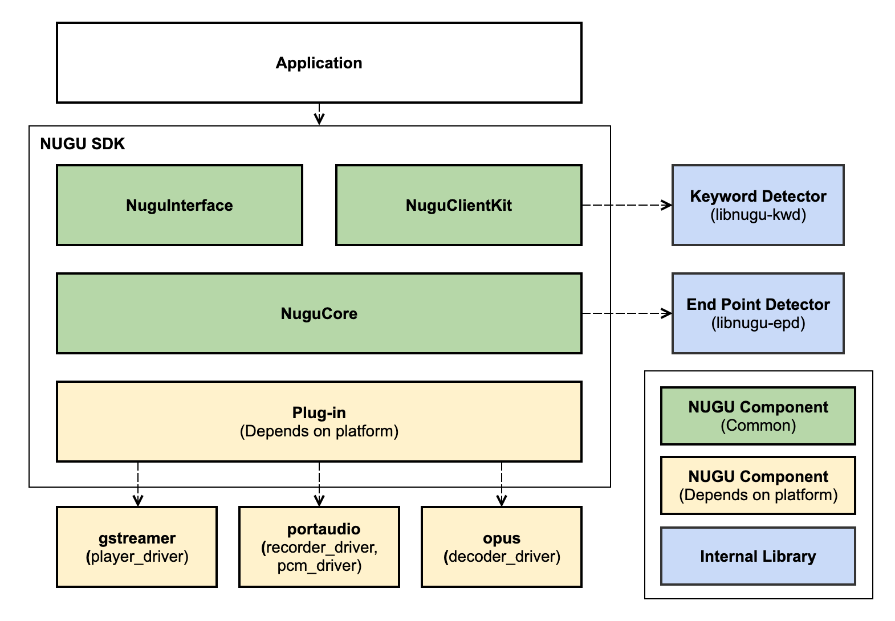

# 구성요소

## 구성요소 목록

* NUGU Component \(Common\)
  * `NuguClientKit`: NUGU 서비스를 쉽게 개발할 수 있도록 도와주는 기능을 제공합니다.
  * `NuguInterface`: Capability를 쉽게 제어할 수 있는 API를 제공합니다.
  * `NuguCore`: NUGU 서비스 개발에 필요한 구성요소들을 제공합니다.
* NUGU Component \(Depends on platform\)
  * Plug-in: 디바이스 특성에 맞게 미디어 드라이버를 구현할 수 있는 API를 제공합니다.
  * `gstreamer`: plug-in에서 제공하는 `player_driver`를 이용해서 `gstreamer`를 통한 미디어 재생 기능을 제공합니다.
  * `portaudio`: plug-in에서 제공하는 `recorder_driver`, `pcm_driver`를 이용해서 `portaudio`를 통한 음성 데이터 입/출력 기능을 제공합니다.
  * `opus`: plug-in에서 제공하는 `decoder_deriver`를 이용해서 opus 코덱을 디코딩 합니다.
* Vendor Component
  * `libnugu-kwd`: NUGU의 키워드를 감지하는 기능을 제공합니다.
  * `libnugu-epd`: 발화의 시작과 끝을 감지하는 기능을 제공합니다.

## 의존성 목록

NUGU SDK for Linux는 아래의 외부 라이브러리를 사용하고 있습니다. 때문에 사용하고 있는 Linux 시스템에 아래 패키지들이 설치되어 있어야 합니다.

<table>
  <thead>
    <tr>
      <th style="text-align:left">&#xC774;&#xB984;</th>
      <th style="text-align:left">&#xD328;&#xD0A4;&#xC9C0;&#xBA85;</th>
      <th style="text-align:left">&#xB77C;&#xC774;&#xC13C;&#xC2A4;</th>
    </tr>
  </thead>
  <tbody>
    <tr>
      <td style="text-align:left">PortAudio</td>
      <td style="text-align:left">
        
libportaudio2

        
portaudio19-dev

      </td>
      <td style="text-align:left"><a href="http://www.portaudio.com/license.html">MIT</a>
      </td>
    </tr>
    <tr>
      <td style="text-align:left">Alsa</td>
      <td style="text-align:left">
        
libasound2

        
libasound2-dev

      </td>
      <td style="text-align:left"><a href="https://git.alsa-project.org/?p=alsa-lib.git;a=blob;f=COPYING;h=ae23fcfda2da8599b52baff4c257847205d78c56;hb=HEAD">LGPL</a>
      </td>
    </tr>
    <tr>
      <td style="text-align:left">Opus</td>
      <td style="text-align:left">
        
libopus0

        
libopus-dev

      </td>
      <td style="text-align:left"><a href="https://git.xiph.org/?p=opus.git;a=blob;f=LICENSE_PLEASE_READ.txt;h=bc88efa6cb05789a6a6e697577ae6d8e5532e5df;hb=HEAD">BSD</a>
      </td>
    </tr>
    <tr>
      <td style="text-align:left">GStreamer</td>
      <td style="text-align:left">
        
libgstreamer1.0-0

        
libgstreamer1.0-dev

        
libgstreamer-plugins-base1.0-0

        
libgstreamer-plugins-base1.0-dev

      </td>
      <td style="text-align:left"><a href="https://gstreamer.freedesktop.org/documentation/application-development/appendix/licensing.html?gi-language=c">LGPL</a>
      </td>
    </tr>
    <tr>
      <td style="text-align:left">GLib</td>
      <td style="text-align:left">
        
libglib2.0

        
libglib2.0-dev

      </td>
      <td style="text-align:left"><a href="https://developer.gnome.org/glib/stable/glib.html">LGPL</a>
      </td>
    </tr>
    <tr>
      <td style="text-align:left">SSL</td>
      <td style="text-align:left">
        
libssl1.1 (bionic) or libssl1.0.0 (xenial)

        
libssl-dev

      </td>
      <td style="text-align:left">
        
<a href="https://www.openssl.org/source/license.html">Apache v2 (&gt;=3.0.0)</a>
        

        
<a href="https://www.openssl.org/source/license.html">dual OpenSSL and SSLeay license(&lt;3.0.0)</a>
        

      </td>
    </tr>
    <tr>
      <td style="text-align:left">zlib</td>
      <td style="text-align:left">
        
zlib1g

        
zlib1g-dev

      </td>
      <td style="text-align:left"><a href="https://www.zlib.net/zlib_license.html">zlib</a>
      </td>
    </tr>
    <tr>
      <td style="text-align:left">Keyword detector</td>
      <td style="text-align:left">
        
libnugu-kwd

        
libnugu-kwd-dev

      </td>
      <td style="text-align:left">Apache v2</td>
    </tr>
    <tr>
      <td style="text-align:left">End point detector</td>
      <td style="text-align:left">
        
libnugu-epd

        
libnugu-epd-dev

      </td>
      <td style="text-align:left">Apache v2</td>
    </tr>
  </tbody>
</table>그리고 아래의 외부 Open source들을 NUGU SDK for Linux에 포함하여 빌드하고 있습니다.

| 이름 | 주소 | 라이센스 |
| :--- | :--- | :--- |
| libcurl | [https://github.com/curl/curl.git](https://github.com/curl/curl.git) | [MIT style license](https://curl.haxx.se/docs/copyright.html) |
| nghttp2 | [https://github.com/nghttp2/nghttp2.git](https://github.com/nghttp2/nghttp2.git) | [MIT](https://github.com/nghttp2/nghttp2/blob/master/COPYING) |
| jsoncpp | [https://github.com/open-source-parsers/jsoncpp.git](https://github.com/open-source-parsers/jsoncpp.git) | [MIT](https://github.com/open-source-parsers/jsoncpp/blob/master/LICENSE) |

