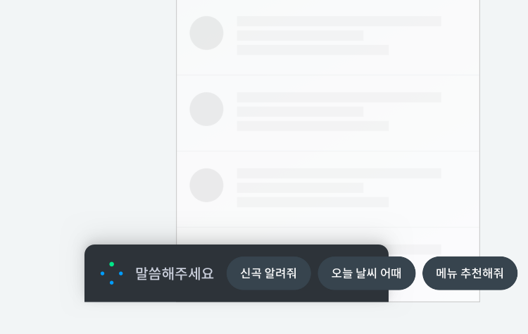

# Voice Chrome

화면이 있는 기기는 NUGU Voice chrome을 표현해야 합니다.  
NUGU Voice chrome은 사용자의 음성 입력 수신, NUGU 음성 출력 등 NUGU 음성 동작과 관련된 상태를 버튼 및 그래픽과 색상으로 표현합니다.  
Voice chrome 외에 디스플레이 기능을 추가하기 위해 LED를 사용할 수도 있습니다.

## **NUGU Voice Chrome 색상** 

| Color | RGB | CMYK | Pantone |
| :--- | :--- | :--- | :--- |
|  NUGU Blue | 0,158, 255 \(\#009DFF\) | 85, 21, 0, 0 | 2925C |
|  Green | 0, 230, 136 \(\#00E688\) | 48, 0, 45, 0 | 2412C |

## **NUGU Voice Chrome 상태** 

NUGU Voice chrome은 구분된 상태에 따라 표현이 달라집니다.  
Idle 상태는 '**NUGU Voice button**'을 사용하고, 나머지 상태는 그래픽 애니메이션으로 표현합니다.  
상태 그래픽은 '**Chrome indicator**'라고 말합니다.  
기기에 wake-up 버튼이 탑재해 있을 경우 NUGU Voice button은 미노출도 허용합니다.

| **상태**  | **동작** | **설명** |
| :--- | :--- | :--- |
| **Idle** |   | Wake-up 가능한 대기 상태 |
| **Listening-Passive** |  | 사용자 발화 입력 대기 상태 |
| **Listening-Active** |  | 사용자 발화 입력 중 상태 |
| **Processing** |  | 입력된 사용자 발화를 분석하는 상태 |
| **Speaking** |  | 정보/동작에 대해서 TTS 답변하는 상태 |

\[동작설명\]

* 사용자가 호출어를 부르거나 Idle 버튼을 눌러 클라이언트가 **사용자 발화 입력 대기 모드**로 진입하면 **Listening-Passive** 동작을 재생합니다.  \(사용자가 호출어를 부르는 동작만 수행하는 기기에는 Idle 버튼을 표시하지 않을 수도 있습니다.\)
* **Listening-Passive** 동작을 사용자의 실제 음성 입력이 시작되기 전까지 반복 재생합니다.
* 사용자의 실제 음성이 입력되기 시작하여 클라이언트가 **사용자 발화 입력 중** 모드로 진입하면 사용자의 음성 입력이 끝날 때까지 **Listening-Active** 동작을 반복 재생합니다.
* 사용자의 입력이 끝나고 클라이언트가 **입력된 사용자 발화를 분석하는 상태**로 진입하면 응답을 출력하거나 결과 화면을 보여주기 전까지 **Processing** 동작을 반복 재생합니다.
* 응답\(TTS\)을 출력할 때는 **Speaking** 동작을 TTS가 종료될 때까지 반복 재생합니다.  Speaking 상태 그래픽은 TTS로만 안내되는 경우에는 표출하지 않을 수 있습니다. 
* 사용자 요청에 대해 필요한 작업을 모두 수행하면 클라이언트가 **Idle** 상태로 진입하게 됩니다.

## **NUGU Voice Button**

NUGU Voice button은 음성 인풋이 가능한 대기 상태를 나타내는 버튼입니다.  
BLUE / WHITE 컬러타입 중 한 가지를 선택 적용할 수 있습니다.

  
Idle 상태에 적용되며, **FAB** \(Floating Action Button\) 또는 **Button** 타입으로 사용하는 것을 권장합니다.                           \(FAB과 Button은 Elevation값에 차이가 있습니다.\)

FAB과 Button에 따른 사용 및 동작정의는 다음과 같습니다.

NUGU 버튼과 아래 레이어의 콘텐츠가 중첩되는 경우 **FAB 사용** \(화면 우하단 권장\)                                                                                              NUGU 버튼이 콘텐츠 중첩 없이 독립된 영역을 확보하고 있는 경우 **Button 사용** \(검색창 옆 권\)



\(1\) **FAB**을 눌러 보이스크롬을 호출하면 FAB 버튼은 사라집니다.

\(1-1\) **FAB**은 스크롤 방향에 따라 노출 여부를 달리할 수 있습니다.




\(2\) **Button**을 눌러 Voice Chrome을 호출하면, Toggle Button 버튼으로 상태가 변경됩니다.




## **NUGU Voice chrome Window**

Voice Chrome 실행시 NUGU Voice chrom Window가 활성화됩니다. Voice chrome은 최상단 레이어로, 화면의 하단 영역에 위치합니다. Light / Dark Theme  중 한 가지를 선택 적용할 수 있습니다.

| Light Theme |  Dark Theme |
| :--- | :--- |
|  |  |

Voice chrome window를 닫는 동작은 아래 2가지입니다. App 화면 영역 터치 시 Voice chrome window는 닫히는 것을 권장합니다.

App 화면 영역을 터치하면, **Voice Chrome이 닫히고, 해당 화면의 액션버튼이 실행**됩니다.

