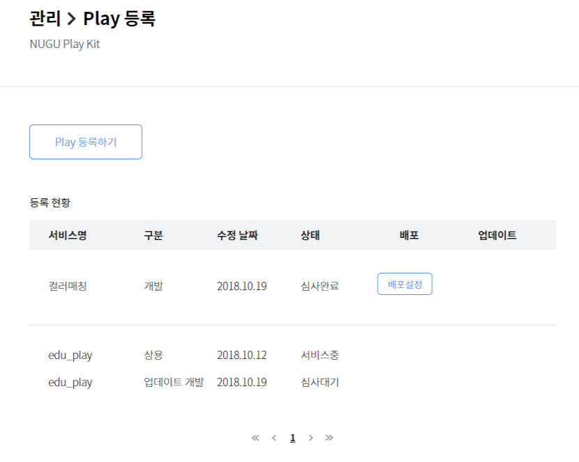

Play 심사 {#play-review}
====================

`NUGU play kit` > `관리` 메뉴에서 Play 심사에 필요한 각종 정보(기본 정보, 연동 정보, 배포 정보)들을 모두 빠짐없이 등록을 한 후에 심사 요청을 하면 Play에 대한 심사가 시작됩니다.([심사 요청](#review-request))

Play 심사 중에는 Play 정보를 수정할 수 없기 때문에 수정이 필요한 경우에는 심사 요청을 취소하고, 정보를 수정하여 다시 요청하면 됩니다.([심사 취소](#review-cancellation))

Play 심사가 시작되면  심사 중으로 상태가 변경되고, 이 과정에서 Play에 대한 정보 검증, 개발 검증 그리고 NUGU 스피커 등에서의 동작을 검토합니다.

계정 연동 테스트가 필요한 경우에는 이 부분도 검증합니다.([심사 정책](#review-policy) / [심사 프로세스](#review-process))

Play 심사 기간은 최소 1주에서 최대 2주이며, 심사 결과 정상적으로 서비스가 가능하다고 판단하면 **심사 완료**, 수정이 필요한 경우에는 **반려** 의견을 드리게 됩니다.([심사 프로세스](#review-process))


Play 심사 승인이 거절되면 Play 반려 사유 리포트를 Play 기본 정보 등록 시 기입한 담당자 연락처(이메일)로 전달합니다. 
“Play 반려 사유”에 대한 이슈를 해결한 후 재심사를 요청할 수 있으며, Play 재심사 프로세스는 Play 심사 절차와 동일합니다.


## 심사 요청 {#review-request}

Play 정보를 모두 입력한 뒤에는 Play 서비스 적합성에 대해 심사 요청하여 승인을 받아야 합니다.

배포/심사 정보 페이지 하단에 위치한 `심사요청` 버튼을 클릭하여 Play의 심사를 요청합니다. 

심사 요청과 동시에 Play 상태는 심사 대기로 전환되고, Play 심사 담당자에게 심사 요청 사항이 자동으로 전달됩니다.
Play 상태는 `NUGU developers` > `NUGU play kit` > `관리` 페이지의 **등록 현황**에서 확인할 수 있습니다.


심사 요청된 Play 정보를 운영자가 검토하여 필수 정보가 누락된 경우에는 본격적인 심사 과정을 진행하기 전에 반려할 수 있습니다.  
반려된 경우에는 등록 현황에 `반려` 상태로 표시됩니다.


## 심사 취소 {#review-cancellation}
Play 심사가 시작하기 전인 심사 요청 상태(**심사대기** 상태)일 때는 언제든지 `심사취소` 버튼을 클릭하여 요청하신 Play 심사를 취소할 수 있습니다.


운영자가 심사 요청을 받아 심사를 시작한 경우(`심사중` 상태)에는 심사 취소를 할 수 없습니다.


 
1. `NUGU developers` > `NUGU play kit` > `관리` > `Play 등록` 페이지의 등록 현황에서 심사를 취소할 **심사대기** 상태의 Play를 클릭하여 선택합니다.

2. 배포/심사 정보 페이지 하단에 위치한 `심사취소` 버튼을 클릭하여 심사 취소를 완료합니다.

3. 심사 취소 요청과 동시에 Play는 등록 중 상태로 바뀝니다.
(Play 등록 상태는 `NUGU developers` > `NUGU play kit` > `관리` > `Play 등록` 페이지의 **등록 현황**에서 확인할 수 있습니다.)

## 심사 정책 {#review-policy}
Play의 심사는 등록 정보에 대한 검토와 기술적 검토로 나눠서 진행합니다.

등록한 정보에 대한 검토에서는 오탈자 뿐만 아니라 등록한 정보에 대한 정합성도 함께 검토합니다. 이 과정에서 운영자는 필요한 추가 정보를 요청할 수 있으며, 적합한 정보를 제공하지 못한 경우에는 NUGU developers의 내부 기준에 따라 Play의 심사를 반려할 수 있습니다.

등록 정보에 대한 검토 후 기술적 검토에서는 제출한 서비스 시나리오를 기본으로 하여 정상적으로 동작을 하는지 스피커와 같은 NUGU 서비스 접점(PoC)에서 테스트를 하게 됩니다. 이 과정에서는 주로 Play의 개발 완성도나 서버와의 연결, 계정 연동과 같은 기술적인 부분을 검토하게 됩니다. 이 단계에서 NUGU developers에서 정한 내부 품질 기준을 만족시키는 Play는 심사 승인이 되고, 개발사에서 배포를 할 수 있는 단계로 넘어가게 됩니다. 반대로 기준을 만족하지 못한 Play는 반려되며, Play Builder나 서버쪽을 재검검한 후 심사를 다시 요청하면 됩니다.

심사 과정에서 기준이 되는 NUGU developers의 심사 정책은 다음과 같으며, 이는 별도의 통보 없이 서비스 환경의 변화에 따라 수시로 업데이트될 수 있습니다. 따라서 심사를 요청하기 전에 다음 정책을 주의 깊게 읽어보는 것이 필요하며, 업데이트된 내용을 자주 확인하는 것이 좋습니다.

### 심사 정책
NUGU developers에서는 귀사의 Play가 정책에서 금지하는 콘텐츠나 서비스를 포함하거나, 부적절한 서비스로의 이동을 제공하거나 유도한다고 판단하는 경우, 그 즉시 Play에 대한 심사를 보류 또는 반려하거나 서비스 운영을 정지하고, 등록하신 개발자 계정 내의 연락처, 이메일 등을 통해서 관련된 사항을 안내하게 됩니다.

이런 조치의 기준이 되는 사항은 아래와 같습니다.

#### 1. 상표권, 지식 재산권 그리고 브랜드 관련 위반 사항

1. NUGU의 브랜드를 명시하거나 NUGU 브랜드와 연계되어 있다고 오인할 수 있는 표현을 쓰면 안 됩니다.
  * Play 서비스 이름이나 호출 이름(Invocation name) 그리고 Play 설명 등에 NUGU와 사전에 협의되지 않은 내용으로 NUGU를 언급하는 것은 소비자에게 잘못된 인식을 줄 수 있기 때문에 허용하지 않습니다.
  * 물론, 사전에 NUGU와 합의한 경우에는 예외적으로 사용하실 수 있습니다.
    예) NUGU 날씨, 공연정보 for NUGU
  * 위와 같이 NUGU 브랜드를 쓰고 싶으신 경우, 별도의 채널(제휴 제안 : 링크 또는 1:1 문의하기 : 링크)을 통해서 연락하면 검토를 거쳐 사용에 대한 의견을 드리도록 하겠습니다.
2. Play 아이콘에 NUGU 브랜드 또는 SKT 브랜드와 같은 부분을 포함하여 사용하실 수 없습니다.
  * 일부 "with NUGU 서비스"의 경우에는 NUGU에서 인증한 아이콘을 사용하실 수 있습니다.
    * 예) 카카오톡 공식 서비스로 오인할 수 있는 color와 icon을 그대로 사용한 예 --> 사용 불가  
    카카오톡 공식 서비스 App 아이콘(우하단에 로고 제공)  --> 이런 건은 제휴 프로그램으로 진행 가능
3. NUGU나 SK텔레콤 뿐 아니라 타사의 브랜드나 상표권 그리고 지식재산권을 침해하면 안 됩니다.
   * 귀사가 해당 브랜드, 상표권 그리고 지식재산권에 대해서 합법적인 권한을 가지고 있는 경우에는 심사 과정에서 확인할 수 있도록 적법한 권함이 있음을 명확하게 표시하고, 관련 증거를 제출해야 합니다. NPK의 관리 메뉴에서 심사 정보 제출 시, 첨부 파일을 통하여 관련 자료를 제출하면 NUGU developers에서 심사 시 이를 통해서 확인하도록 하겠습니다.
   * 운영자는 심사 진행 중에 추가로 필요한 정보가 있는 경우 증명을 요청할 수 있습니다. 이런 일련의 과정을 통해서도 해당 브랜드, 상표권 그리고 지식재산권에 대한 적법한 자격을 증명하지 못한 경우에는 심사가 반려됩니다.
   * 서비스 중인 Play도 브랜드, 상표권 그리고 지식재산권에 대해 자격 증명을 요청 또는 재요청 할 수 있으며, 이 과정에서도 증명이 되지 않는 경우에는 즉시 서비스를 중단할 수 있습니다.

#### 2. (연령 등급) 어린이를 위한 Play
1. 현재 NUGU developers 의 모든 Play는 "전체연령가" 등급만을 서비스할 수 있습니다. 따라서 Play에서 제공하는 모든 콘텐츠 또는 서비스는 이 등급에 맞는 것만을 제공할 수 있습니다.
2. 전체 연령가에 맞지 않는 외부 서비스로 유도하거나 개인정보를 수집하는 행위도 금지합니다.

#### 3. Health 관련 정보
1. Play를 통해서 사용자의 신체 또는 정신에 대한 건강 정보를 수집하고, 이를 활용한 의료 정보 및 컨설팅을 제공하는 것은 관련 법규에 따라 제한됩니다.
2. NUGU play를 통해서 건강 관련 서비스를 제공하기 위해서는 Play 실행 시, "이 Play는 참고용 의료 정보만을 제공할 뿐이며, 전문적인 의료 조언이나 치료, 진단을 제공할 수 없습니다. 이런 부분이 필요하신 경우, 반드시 의사에게 먼저 상의하시길 바랍니다."라는 내용과, "응급 상황인 경우, 119로 전화 연결을 해주시기 바랍니다."라는 내용을 반드시 포함해야 합니다.
3. NUGU play의 이름으로는 병원 이름, SOS, 119 등을 사용할 수 없습니다.

#### 4. 스킬 추천, 보상 그리고 구매
1. Play에서 별도의 서비스를 제공하지 않고, 단순히 다른 Play를 추천하는 기능만 제공하는 것은 금지합니다.
2. Play를 사용 중 다른 Play를 호출할 때 보상을 해주는 형태도 금지합니다.
   * 상에는 디지털 재화(쿠폰, 포인트) 뿐만 아니라 물리적인 상품이나 현금 등을 포함합니다.
3. 다만 예외적으로 기부를 하기 위한 Play는 허용하며, 이는 NUGU에서 제공하는 결제를 통해서만 가능합니다. 기부를 위한 Play를 만들기 위해서는 NUGU developers의 제휴제안을 통해서 먼저 신청해주세요.
4. NUGU play는 현재 Play 내 구매(in app purchase) 기능을 제공하고 있지 않습니다. 따라서 Play 내 프리미엄 기능 등을 위해서 필요로 하는 유료 기능은 현재 제공을 위해 준비하고 있으며, 그 전까지는 모두 무료로만 제공할 수 있습니다.
   * 유료 판매 기능이 제공될 때, NUGU developers에서는 유료 구매에 대한 가이드를 포함하여 본 문서를 업데이트할 예정입니다.

#### 5. 광고
*NUGU open platform에서는 현재 전면 광고 및 Play 내 광고 등 모든 광고를 허용하지 않고 있습니다. 수익을 위해 광고 제공이 꼭 필요한 경우, NUGU developers의 1:1 문의하기나 제휴제안을 통해서 문의해주세요.

#### 6. 포르노와 성적인 콘텐츠(19금)
* NUGU developers의 모든 Play는 전체 연령가 서비스이므로 당연히 포르노 및 성적인 콘텐츠를 포함된 서비스를 할 수 없습니다. 최초 심사 시 해당 내용을 포함하고 있지 않았으나 Back end proxy의 변경, 변조를 통해서 콘텐츠가 변질되었을 때는 NUGU developers는 해당 내용을 발견하는 즉시 Play의 서비스를 중단하고, 삭제할 수 있습니다. 또한 관련 법규에 의거하여 해당 Play를 제공한 개발자/개발사를 신고할 수 있습니다.

#### 7. 폭력성 콘텐츠(19금)
* NUGU developers의 Play는 전체 연령가 서비스이므로 당연히 폭력적인 내용(극단적인 음란한 내용, 참수, 불안전한 내용 및 과도한 폭력 묘사 등)이 포함된 서비스를 할 수 없습니다. 최초 심사 시 해당 내용을 포함하고 있지 않았으나 Back end proxy의 변경, 변조를 통해서 콘텐츠가 변질되었을 때는 NUGU developers는 해당 내용을 발견하는 즉시 Play의 서비스를 중단하고, 삭제할 수 있습니다. 또한 관련 법규에 의거하여 해당 Play를 제공한 개발자/개발사를 신고할 수 있습니다.

#### 8. 종교, 인종 그리고 문화적 차별
아래 내용이 포함된 Play는 심사에서 반려되며, 서비스 중에 발견되는 즉시 해당 Play를 중단하고, 삭제할 수 있습니다.

1. 특정 그룹이나 개인을 향한 모욕적인 발언이나 혐오감을 표출하는 Play
2. 나치 상징과 같은 증오의 상징을 포함하거나 언급하는 Play
3. 인종이나 성별의 차별을 표현하거나 유도하는 Play

#### 9. 긴급 출동 서비스(통신)
* NUGU developers의 Play를 통해 긴급 구조 등을 요청하는 서비스를 제공할 수 없습니다.
이런 경우에는 반드시 다른 연락 수단(전화) 등을 통해서 119에 요청하실 것을 권하며, 해당 서비스를 제공하고자 하는 Play는 서비스할 수 없습니다.

#### 10. 다음의 내용이 포함된 콘텐츠는 Play로 서비스할 수 없습니다.
1. 불법 자료를 다운로드 받도록 유도하거나 torrent 등을 유도하는 Play
2. 불법 조직에 가입하는 방법에 대해 구체적으로 안내하는 Play
3. 매춘과 같은 불법적인 내용에 대해서 안내하거나 연결을 해주는 Play
4. 위험물질(예: 폭탄, 총기 등)에 대한 제작 방법을 안내하거나 이를 구매할 수 있도록 안내하는 Play
5. 테러 집단 등의 신규 회원을 모집하는 Play 또는 테러를 지지하거나 유도하는 Play
6. 불법 약물에 대한 사용을 안내하거나 구입을 유도하는 Play
7. 허용되지 않은 약이나 만능약과 같은 부분을 소개하거나 거래할 수 있도록 유도하는 Play
8. 도박 기능을 이용하여 현금 또는 현금과 동등한 가치를 갖는 보상을 받을 수 있도록 하는 Play
9. 술 또는 담배 등을 판매하는 Play 및 사용을 촉진하는 Play

위 콘텐츠 리스트는 수시로 업데이트될 수 있으며, 해당 리스트에 포함되어 있지 않아도 이에 준하는 콘텐츠를 서비스 하는 경우에는 NUGU developers 의 운영 기준에 따라 별도의 안내 없이 심사 반려 또는 Play 서비스를 중단하고, 삭제할 수 있습니다.

#### 11. 그 외 일반적인 심사 반려 사항
1. NUGU developers에서 지원하지 않는 언어로 Play에 대한 정보를 등록하거나 해당 Play가 지원하지 않는 언어로만 구성되어 있는 경우
2. 악성 기능을 포함하고 있는 경우(불쾌한 소리 등을 내포하고 있는 경우)

### 호출 이름 심사 정책
위의 심사 정책과 더불어, 심사에서 주의 깊게 보는 부분은 Play를 대표하는 이름인 “호출 이름(invocation name)”입니다. 호출 이름은 NUGU platform 내에서 Play를 부를 때 사용하는 이름이기도 하고, 다른 Play와 구분할 때 사용하기도 합니다. 따라서 Play는 유일해야 하며, 발음하기 편하고, 외우기 쉬운 것이 좋습니다.

Play의 호출 이름은 유한한 자원 내에서 우선 순위를 결정해야 하는 경우가 자주 발생하기 때문에 이런 문제를 해결하기 위해 아래와 같은 몇가지 원칙을 가지고 있으며, 이 부분은 서비스 운영을 하면서 계속 추가, 변경될 수 있기 때문에 가장 최신 내용을 항상 검토한 후에 호출 이름을 결정해주시는 것이 좋습니다.

1. 호출이름은 유일해야 합니다. 중복된 단어가 포함된 경우에는 입력 자체가 되지 않습니다. 따라서 특정 호출 이름을 반드시 써야 하는데, 선점한 Play가 있다고 하면 “1:1 문의하기”를 통해서 연락을 주시기 바랍니다.
2. 하나의 Play에는 하나의 호출 이름만을 부여할 수 있습니다. 다만, 해당 Play에 대한 인식률 향상을 위해서 NUGU developers에서는 Play에 별칭(alias)를 부여할 수 있으며, 이는 운영자가 결정하여 통보드릴 예정입니다.
3. 호출 이름은 명사형 단어를 사용하는 것을 원칙으로 하지만, 예외적으로 브랜드명이 명사형이 아닌 경우에는 심사 과정에서 판단하여 명사형이 아닌 호출 이름을 허용하기도 합니다. 명사형 단어의 경우에도 보편적인, 범용적인 표현은 좋지 못하며, 이런 단어를 쓰고 싶으신 경우에는 앞에 한정어를 넣어서 사용하는 것을 권합니다.
  * 호출 이름을 사람이름이나 지명 등의 고유명사로 신청하는 경우에는 위 규칙에 따라 대부분 반려됩니다. 역시 이 경우에도 본인이 소유한 브랜드임을 입증하면, 예외적으로 허용하기도 합니다.
4. 호출 이름은 반드시 3음절 이상이어야 합니다. 3음절 미만의 호출 이름을 신청한 경우에는 심사 반려가 됩니다. 최대 음절은 특별한 제한을 하지 않으나, 8음절 이하를 권고하며, 사용자들이 충분히 쉽게 외워서 발음하기 좋은 길이를 8음절까지라고 보면 됩니다.
5. 호출 이름으로는 NUGU를 호출하는 Wake-up word를 사용하실 수 없습니다. 해당 Wake-up word는 다음과 같으며, 변경될 수 있으니 호출 이름 신청 시 다시 한번 확인하시기 바랍니다.
*NUGU wake-up word : 아리아, 팅커벨, 크리스탈, 레베카, 누구(NUGU)
6. 호출 이름으로 NUGU나 SK텔레콤이 포함된 단어, 그리고 이를 오인할 수 있는 단어를 사용해서는 안 됩니다. 예를 들어 NUGU날씨, 뉴스 for NUGU와 같은 이름은 허용하지 않으며, 정식으로 NUGU와 제휴를 하여 이런 서비스를 제공하고 싶은 경우에는 “제휴제안”을 통해서 제안하시면, 검토하여 연락을 드리겠습니다.
7. 호출 이름은 알파벳, 숫자를 섞어서 사용할 수 있으나, 모두 한글로 풀어서 작성해야 합니다. 이런 경우 8음절을 넘기는 경우가 종종 발생할 수 있는데, 이 부분은 저희가 심사에서 검토를 해보고 최종 허용 여부를 판단하여 안내해드리겠습니다.
  * 예) SK텔레콤 -> 에스케이텔레콤
8. 호출 이름으로 타인의 지식재산권이나 상표권 등을 침해하지 말아야 하며, 분쟁이 생기지 않는 단어를 사용해야 합니다. 분쟁이 발생한 경우에도 SK텔레콤은 중계자로서 해당 분쟁에 관여하지 않습니다. 또한 심사 과정에서 적합한 지식재산권이나 상표권 그리고 브랜드를 소유하고 있는지 확인을 요청할 수 있고, 관련 서류의 제출을 요구할 수 있습니다. 이를 입증하지 못한 경우에는 최종 심사 시, 신청하신 호출 이름의 사용이 반려될 수 있습니다.
9. 모든 호출 이름은 신청 즉시 사용이 확정되지 않습니다. 호출 이름은 심사를 거쳐서 최종 확정이 되며, SK텔레콤은 해당 호출 이름에 대한 사용 허가를 해주는 것이지, 그에 대한 소유권을 드리지 않습니다. 또한 서비스 중에도 NUGU developers의 호출 이름 정책이 변경되어, 사용 중인 호출 이름이 제한될 수 있고, 이런 경우에는 별도로 안내할 예정입니다.
10. 호출 이름에 대해서는 인식률을 높이기 위해 별칭(alias)를 추가할 수 있으며, 이를 위해서는 “1:1 문의하기”를 통해서 요청을 해주셔야 합니다. SK텔레콤에서는 심사를 거쳐 별칭(alias) 부여에 대한 내용을 검토하고 확정하여 말씀드리게 됩니다.
11. Play를 부득이하게 삭제하는 경우, 호출 이름은 삭제일로부터 14일이 지난 후에 회수되며, 회수된 호출 이름은 다른 개발사가 요청 시, 재배정할 수 있습니다.
12. NUGU platform에서는 사용자의 안전을 위해서 의료행위, 긴급 구조와 연관된 단어 또는 이를 연상할 수 있는 표현이 포함된 호출 이름은 엄격히 금지됩니다.

## 심사 프로세스 {#review-process}
운영자는 요청 받은 Play의 심사를 다음의 프로세스를 통해서 진행하게 됩니다.

### 1. Play 등록 정보 검토
* 운영자는 개발자가 등록한 Play 정보의 내용이 사실인지, 사용자에게 보여질 정보에 오탈자는 없는지, 표현 수위는 적절한지 등에 대해 검토합니다.
* 이 과정에서 운영자는 해당 Play의 호출 이름(invocation name)에 대해서도 검토를 하게 됩니다. 호출 이름에 특정 회사명, 상표 등 저작권 이슈가 발생할 수 있는 단어가 포함된 경우에는 관련된 증빙 서류를 개발자에게 요청할 수 있습니다. 이 과정 동안에는 심사가 중단됩니다. 따라서 운영자가 요청하는 내용에 대해서 빠르게 확인을 해주시는 것이 심사 과정을 단축하는 데 도움이 됩니다.

### 2. Play 기술 검증
* 기술 검증(QA) 기간에는 우선 제출하신 서비스 시나리오를 바탕으로 Play의 동작 검증을 준비하게 됩니다. 따라서 Play의 서비스 시나리오를 정확하게 파악할 수 있도록 등록을 해주시는 것이 Play 검증에 도움이 많이 됩니다. 이 과정에서 단순히 발화와 그 결과에 대한 테스트만 진행하는 것이 아니라, 서버 연동, 계정 연동도 테스트하게 됩니다. 따라서 Play 심사 요청 시, Back End Proxy 서버나 계정 서버 등도 상용 수준으로 준비가 되어야 합니다.
* Play에 대한 동작 검증 시에는 실제 음성인식이 잘 되는지 기술적인 검토를 진행합니다. 이 과정에서 제출하신 호출 이름이 적절하게 인식이 되지 않거나, 인식 품질이 현저하게 낮으면 호출 이름을 변경하거나 별칭(alias)을 등록하도록 권유할 수 있습니다. 이런 안내도 역시 등록하신 연락처(이메일)로 발송하므로, 심사 과정에서는 운영자가 발송하는 이메일을 주의깊게 읽어주세요.

### 3. 최종 심사 판정
* Play 등록 정보와 Play 기술 검증을 모두 진행한 후 NUGU developers의 운영팀은 그 결과를 가지고 최종 심사를 판정합니다. 심사 결과는 심사 승인과 반려 두 가지로 구분됩니다. 심사 승인이 된 Play는 배포 요청 상태가 되며, 배포 일정을 설정하면 그 일정에 맞춰 자동으로 배포가 진행됩니다. 
* 반려가 된 경우에는 개발 중 상태 즉 심사 요청 전 상태로 돌아가게 되며, 반려 사유에 대한 리포트를 함께 받게 됩니다. 이 리포트를 참고하셔서 수정 사항을 진행하신 후 다시 심사 요청하면 됩니다. 이 과정에서 반려 사유에 대해서 문의가 있는 경우에는 1:1 게시판을 통해서 문의하시면, 담당자 확인 과정을 거쳐 안내해 드리도록 하겠습니다.
